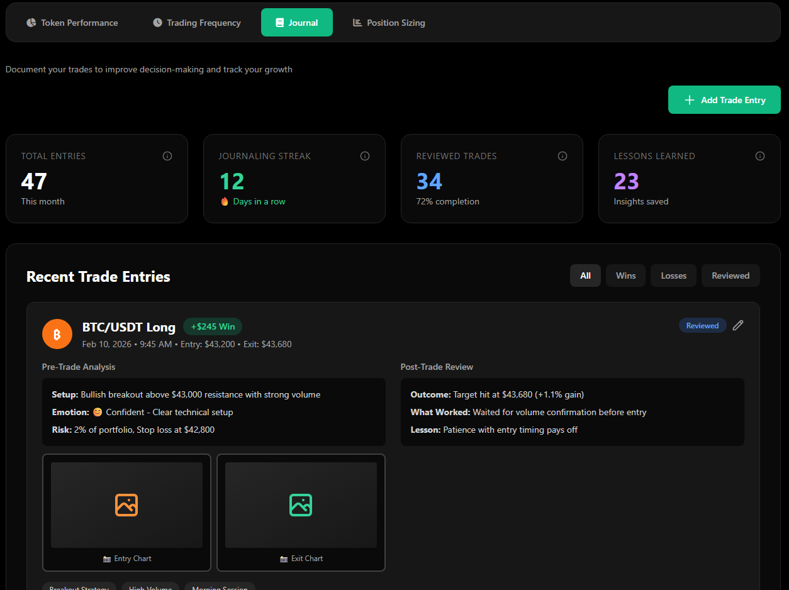
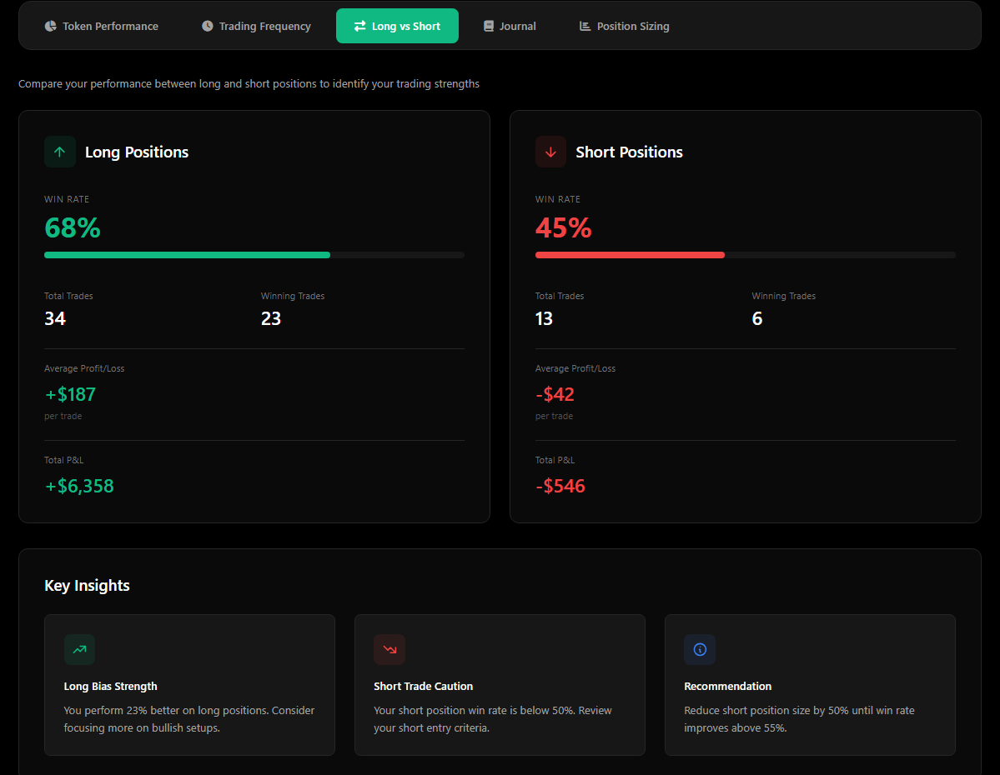
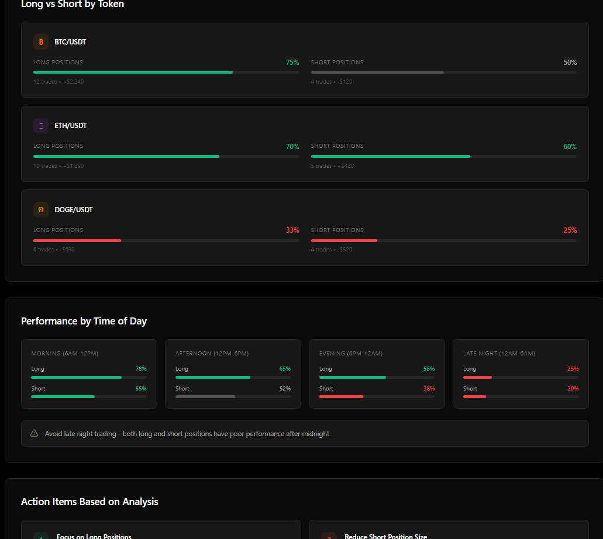
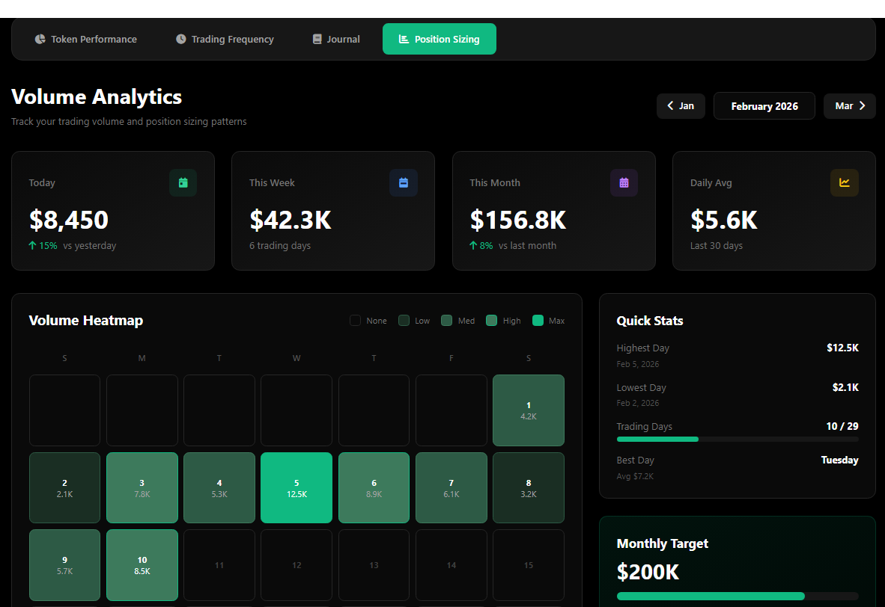
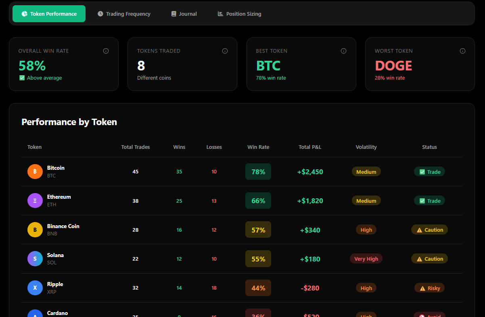
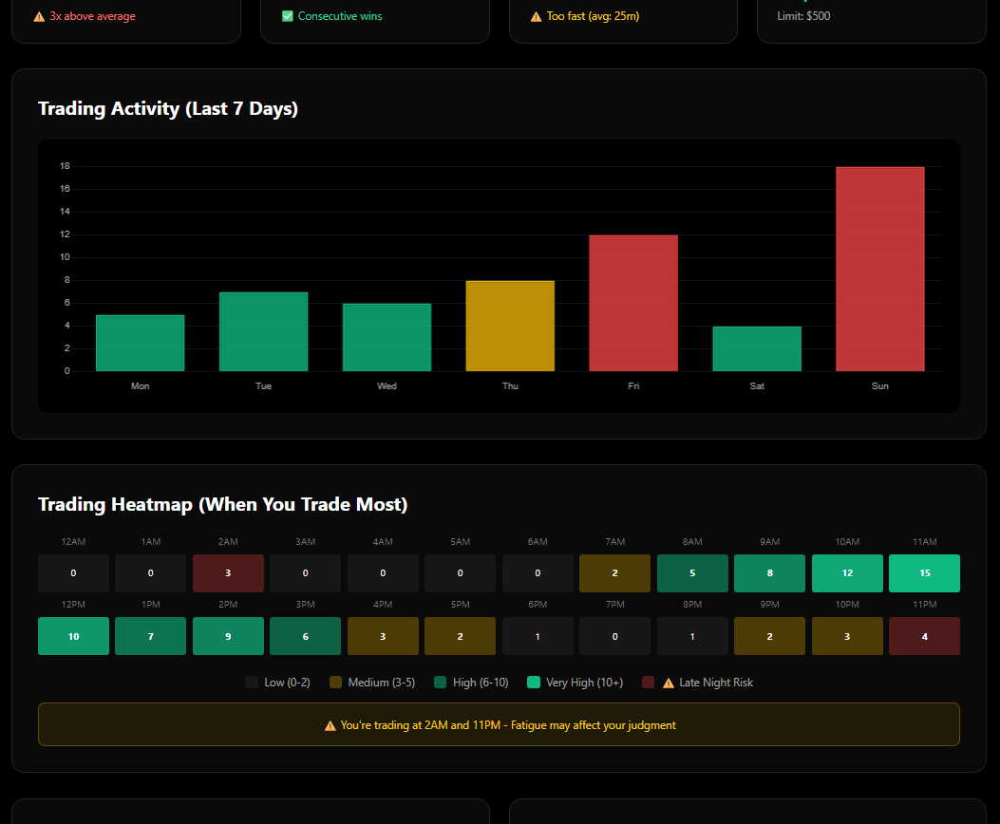
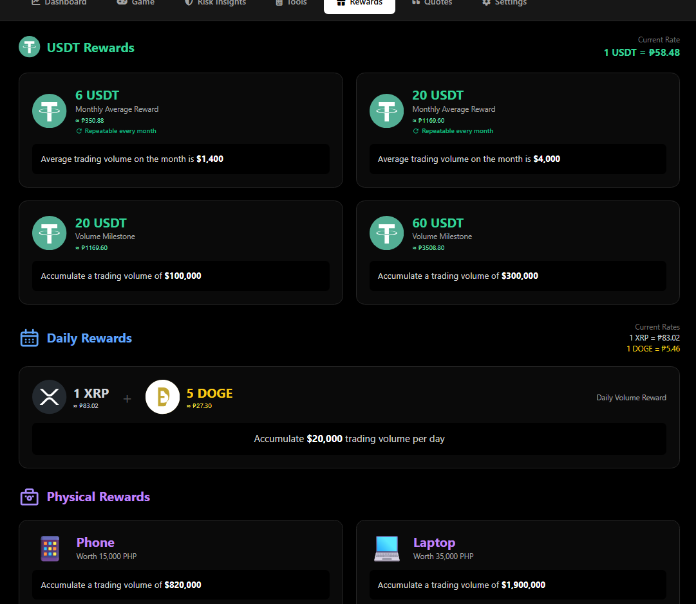
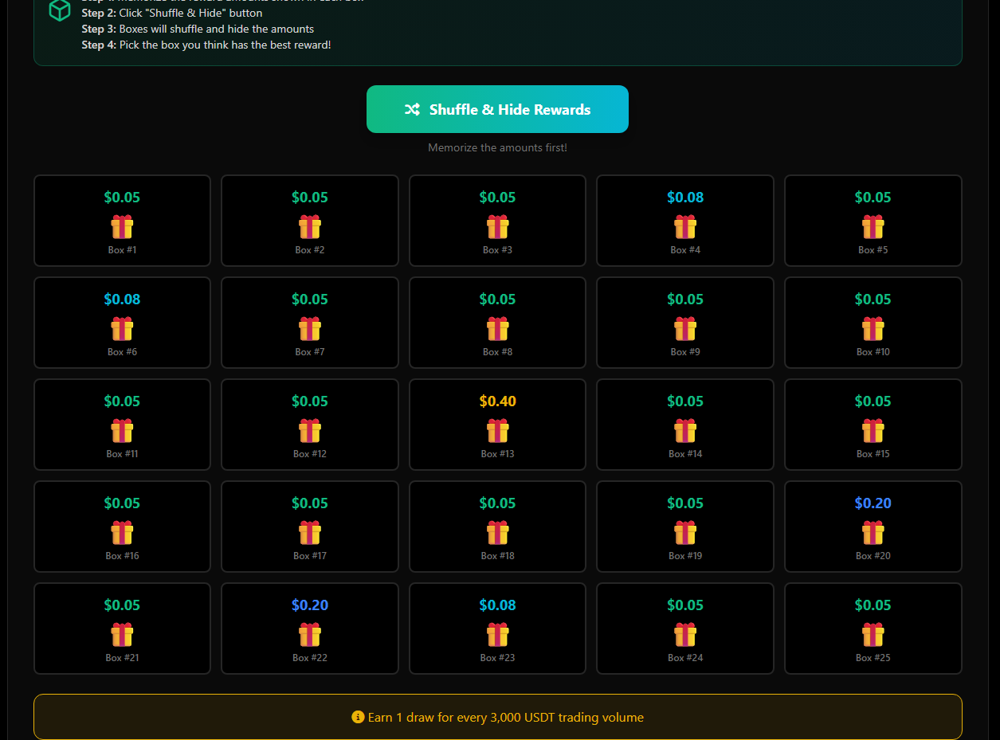

### ENOBIT

Currently in Closed Beta. Access is limited to selected users while we improve features and system stability.

## 📸 Demo Screenshots

### Trading Journal
Document your trades, track emotions, and learn from your trading patterns.

### Long vs Short Analysis
Compare your performance between long and short positions to identify trading strengths.

### Position Sizing Calculator
Calculate optimal position sizes based on your risk tolerance and account balance.

### Token Performance Tracker
Monitor and analyze the performance of different tokens in your portfolio.

### Trading Frequency Analysis
Track your trading patterns and identify optimal trading times.

### Rewards System
Gamified rewards system to encourage consistent trading discipline.

### Lucky Game
Interactive game feature for user engagement.

## 🚀 Features

- **Trading Journal**: Document trades with pre/post-trade analysis
- **Long vs Short Analysis**: Compare win rates and performance between long and short positions
- **Risk Management Tools**: Position sizing calculator and risk assessment
- **Performance Analytics**: Track token performance and trading patterns
- **Emotion Tracking**: Monitor emotional states and their impact on trading
- **Gamification**: Rewards system to encourage good trading habits
- **Interactive Dashboard**: Real-time analytics and insights